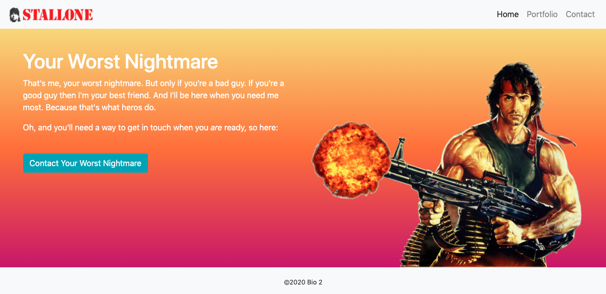
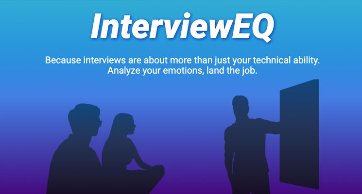

# bio2

This portfolio is built using [Bootstrap](https://getbootstrap.com) to allow for responsive layout and mobile-first design. It features [index](https://vertjames.github.io/bio2/), [contact](https://vertjames.github.io/bio2/contact.html), and [portfolio](https://vertjames.github.io/bio2/portfolio.html) pages.

## Portfolio

The [Portfolio](https://vertjames.github.io/bio2/portfolio.html) page displays projects as they are completed. Click on any of the images to open up the deployed project in a new tab.

## Project 1: InterviewEQ

[InterviewEQ](https://maximilliancharlemagne.github.io/emotion-engine/) is a web app designed to help development job seekers improve their soft skills. Using the [Web Speech API](https://developer.mozilla.org/en-US/docs/Web/API/Web_Speech_API) we convert the user's speech to text, then analyze prominent emotions in that text using the [ParallelDots Emotion Analysis API](https://www.paralleldots.com/text-analysis-apis#emotion), and display the results of that analysis for the user. 

